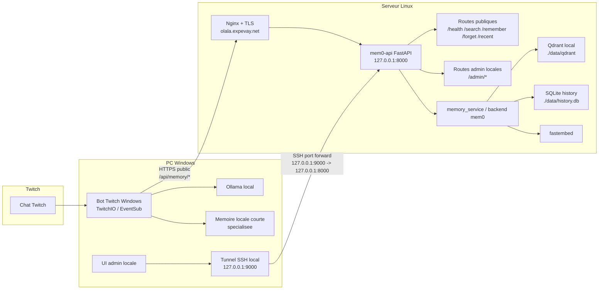

# Contexte Projet — Tolabot mem0

## Objet

Ce projet met en place une memoire distante pour le bot Twitch Windows.

Architecture retenue :
- bot principal sur PC Windows
- Ollama local sur Windows
- service memoire sur serveur Linux
- backend memoire via `mem0`

Le bot Windows ne doit jamais parler directement a `mem0`.
Il parle uniquement a l'API HTTP Linux.

---

## Schema Global



---

## Depot Git

Depot partage :
- `git@github.com:Bakatora000/tolabot.git`

Fichiers de suivi :
- `pilotage_projet_mem0.md` : source de verite legere, etat global, handoffs
- `statut_linux.md` : suivi operationnel Linux
- `statut_windows.md` : suivi operationnel Windows

Code partage :
- `memory_service/` : service Linux
- `windows_bot/` : bot Twitch Windows
- `admin_interface_v1.md` : design V1 pour l'administration memoire via tunnel SSH

---

## Contrat Fonctionnel

Documents de reference :
- `contrat_api_bot_mem0.md`
- `context_codex_linux_mem0.md`
- `context_codex_windows.md`

Convention d'identite :
- `user_id = twitch:<channel_login>:viewer:<viewer_login>`

Exemple :
- `twitch:streamer:viewer:alice`

API publique attendue :
- `GET /api/memory/health`
- `POST /api/memory/search`
- `POST /api/memory/remember`
- `POST /api/memory/forget`
- `POST /api/memory/recent`

Auth :
- header `X-API-Key`

---

## Etat Actuel

### Linux

Etat actuel :
- API FastAPI implemente
- backend `file` valide
- backend `mem0` valide
- service `systemd` actif
- domaine public actif
- TLS valide

URL publique :
- `https://memory.example.net/api/memory`

Healthcheck public valide :
- `https://memory.example.net/api/memory/health`

Stack Linux actuellement en service :
- `mem0ai`
- Qdrant local via `MEM0_QDRANT_PATH`
- SQLite history via `MEM0_HISTORY_DB_PATH`
- embeddings `fastembed`
- provider LLM `lmstudio` pour satisfaire l'initialisation du SDK

Service durable :
- `mem0-api.service`

### Windows

Etat connu :
- client HTTP mem0 implemente
- lecture memoire distante branchee avant Ollama
- ecriture memoire distante branchee apres generation
- fallback local conserve
- validation reelle Windows mem0 deja observee contre l'API Linux
- code source Windows migre dans `windows_bot/`
- memoire hybride stabilisee :
  - `mem0` pour la memoire durable generale
  - memoire locale pour les fils courts specialises
- file FIFO globale bornee en place avec priorite streamer

---

## Fichiers Importants

### Service Linux

- `main.py`
- `memory_service/app.py`
- `memory_service/backend.py`
- `memory_service/config.py`
- `.env.example`
- `deploy/systemd/mem0-api.service`
- `deploy/nginx/memory.example.net.conf`
- `deploy/DEPLOYMENT.md`

### Suivi Projet

- `pilotage_projet_mem0.md`
- `statut_linux.md`
- `statut_windows.md`

---

## Configuration Linux Retenue

Configuration actuellement validee :

```env
MEMORY_BACKEND=mem0
MEM0_HOST=127.0.0.1
MEM0_PORT=8000
MEM0_QDRANT_PATH=/home/vhserver/bt/data/qdrant
MEM0_QDRANT_COLLECTION=mem0
MEM0_QDRANT_ON_DISK=true
MEM0_HISTORY_DB_PATH=/home/vhserver/bt/data/history.db
MEM0_LLM_PROVIDER=lmstudio
MEM0_LLM_MODEL=dummy-local-model
MEM0_LMSTUDIO_BASE_URL=http://127.0.0.1:1234/v1
MEM0_EMBEDDER_PROVIDER=fastembed
MEM0_EMBEDDER_MODEL=BAAI/bge-small-en-v1.5
MEM0_EMBEDDER_DIMS=384
```

Note importante :
- `mem0` initialise aussi le provider LLM au demarrage
- `/remember` utilise `infer=False`
- le backend stocke donc le texte brut conforme au contrat du bot

---

## Incidents Techniques Deja Resolus

- absence initiale de service durable Linux
- certificat TLS incorrect sur `memory.example.net`
- mauvais routage public vers une page HTML AMP
- alignement corrige du routage public vers `/api/memory/...`
- chargement `.env` corrige cote Python
- unite `systemd` corrigee pour utiliser `/usr/bin/python3` et `PYTHONPATH=/home/vhserver/bt/.deps`

---

## Point De Vigilance

- Qdrant tourne actuellement en mode local par `path`
- c'est pragmatique et valide pour la prod initiale, mais pourra etre remplace plus tard par un service dedie si besoin

- `fastembed` peut telecharger son modele au premier lancement
- il faut garder cela en tete en cas de redeploiement ou de machine neuve

- la cle `MEM0_API_KEY` doit rester uniquement dans les fichiers `.env` locaux

---

## Prochaines Actions Probables

- surveiller les premiers usages reels cote Windows
- ajuster les logs si besoin
- confirmer si la config Qdrant locale est gardee telle quelle
- durcir eventuellement la config Nginx / systemd apres retour d'usage
- concevoir puis implementer une admin API locale Linux
- concevoir une UI Windows locale ouvrant automatiquement un tunnel SSH d'administration

---

## Resume Court

Le projet Tolabot mem0 est maintenant operationnel :
- bot Windows connecte a une API Linux distante
- memoire distante fonctionnelle en reel
- domaine public et TLS valides
- service Linux durable installe

Le repo partage contient maintenant le code, la doc, les statuts separes et le contexte necessaire pour reprendre le projet rapidement.
